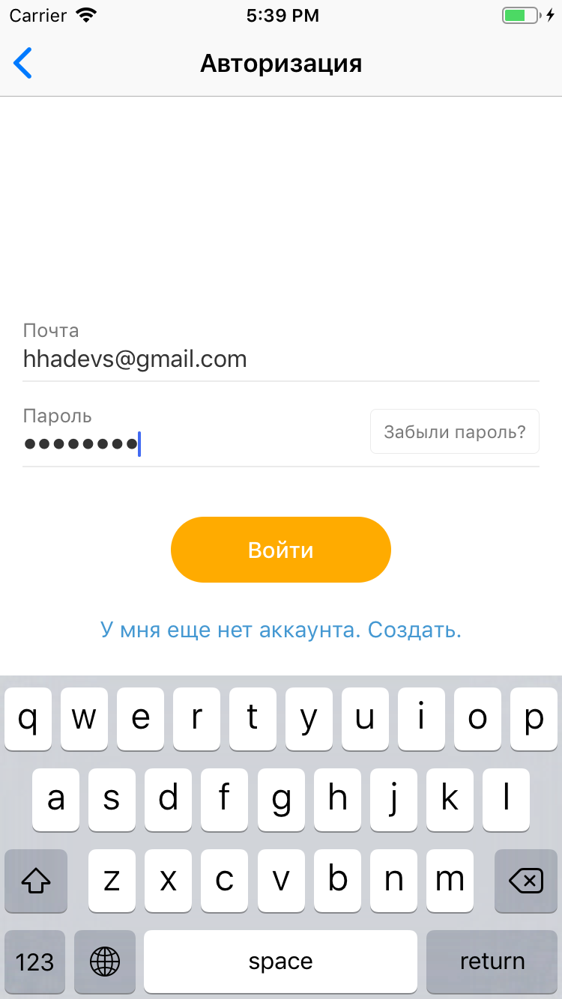
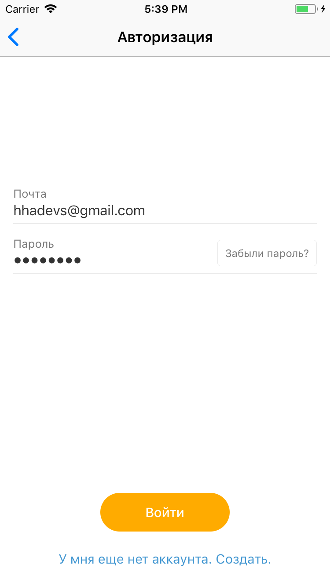
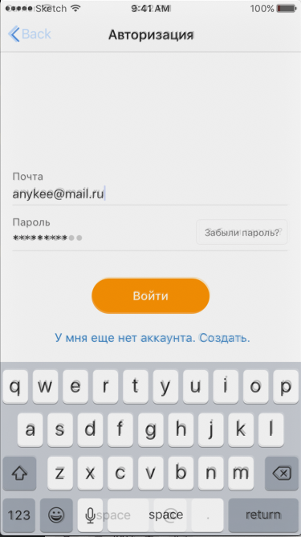

# headsAndHands-test

## Тестовое задание для Heads And Hands

В качестве архитектуре был выбран VIPER для возможности декомпозиции небольшой логики экрана и взаимодействия с сервером.

Сервисный слой построен по архитектуре SOA без оберток над Alamofire и прямым запросом на сервер.
Что можно было бы добавить:
* Покрыть все модули протоколами с In/Out соединениями
* Написать обертку над Alamofire, и сделать функционал декодинга сущностей через Generic
* Перенести все стринги в локализованные
* Подключить Dependency Injection

В данном проекте я не использую статические функции или синглтоны, но так же я и не стал подключать большой фреймворк для Dependency Injection в такой маленький проект. Пробросил все вручную.
